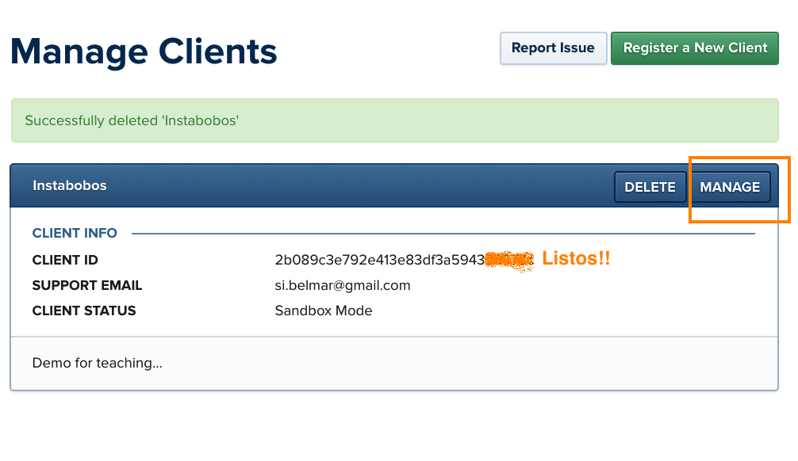
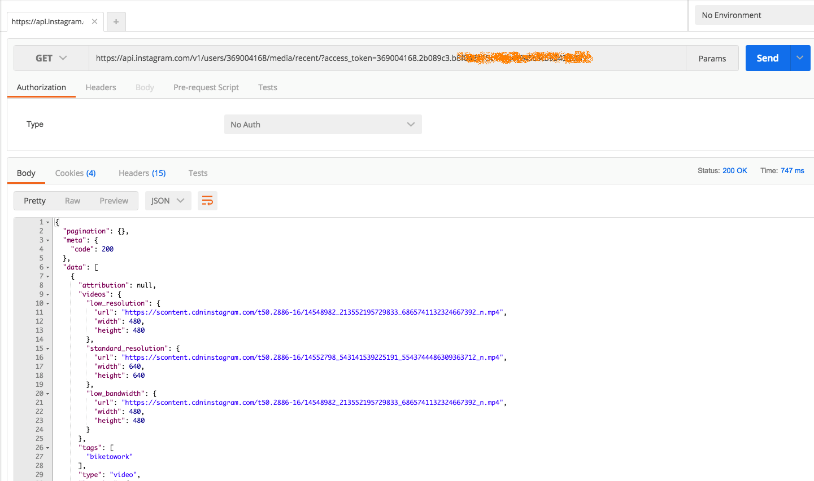

# Instagram Magic

## Run it
* ` $ Shotgun` or `$ Unicorn` (look into the difference)
* Visit localhost:9393 or localhost:8080 (if defaults) 

## Maria las llaves!! Get your keys...

[Go to the Instagram Dev site](https://www.instagram.com/developer/)


### Go here to start the registration!


### Register like a champ!
* Ports are important...
* Examples:
	* Website URL: `http://localhost:9393/`
	* Redirect URL: `http://localhost:9393/auth/callback`


### Done and Manage


### Your credentials


## In the APP
### Add your credentials to the controller Instagram.rb:
```
  config.client_id = "2b089c3e792e413e83df3a594xxxxx"
  config.client_secret = "9302a2b100ae4494a8d43c65xxxxxx"
```  

### Get the access_token :S
	0 Shotgun
	1 Visit '/'  
	2 Press the Instagram Logo  
	3 Authorize  
	4 PROFIT!!!  

### And the token ???
In the servers logs (terminal)
```
"######### accsess_token ##############"
"369004168.2b089c3.b8f0a8115c144dxxxxxxx"
"--------------------------------------"
```

### Test other Instagram Endpoints
access_token + Postman


# THE FLOW of OAuth 2.0
## This this steps commented on app/controllers/instagram.rb

* Step 0: Provide a way to manage a ridirect to the third party login. 

* Step 1: Redirect the users to the third party Auth url. This redirect usually require send some query params to notify the third party who you are and where are you comming from.  

* Step 2: The third party service will responde back to your application to the callback URL. In this case they are responding with a code. Look the what the params have.  

* Step 3: Once you have the code. Format a Post request to get an access token and some Users information. Inspect the response out of that Post. Use this info to create a user in your DB save and the token in the sessions hash.  

* Step 4: Use the access token saved in the session hash to consume the API  

